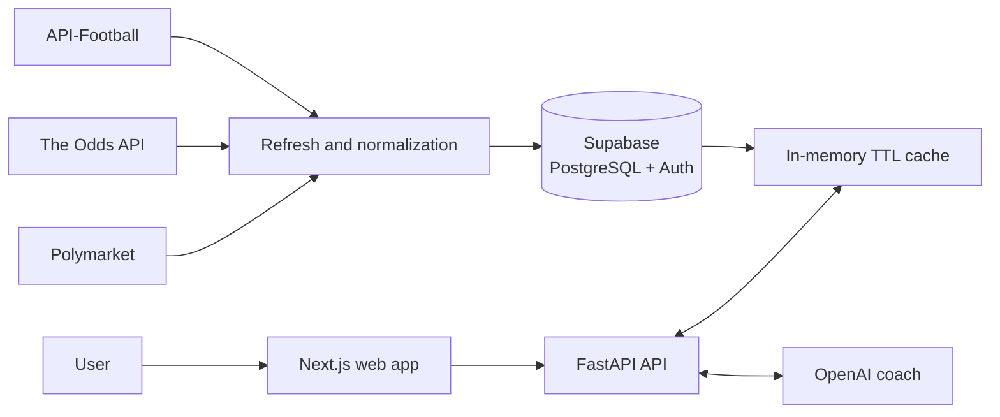

<div align="center">
  

  <h1>Matchmind</h1>

  <p>
    An AI-powered betting coach built for the 2026 FIFA World Cup.<br />
    It combines bookmaker odds, football data and prediction-market signals to give users a direct second opinion before they place a bet.
  </p>

  <p>
    
    
    
    
  </p>
</div>

> [!NOTE]
> Matchmind is a discontinued portfolio project. The hosted application is no longer operational, and this repository is preserved as a technical case study. The product analyzed bets but never placed bets or handled betting funds.

## Overview

Matchmind was designed around a simple question: _is this bet actually worth taking?_

Instead of relying on a single source, the application brings together bookmaker prices, football context and prediction-market probabilities. An AI coach turns that data into a concise verdict, an estimated probability and a confidence score.

The project covers the full product surface: a mobile-first web app, authenticated API, normalized provider data, background refresh flows, AI orchestration, payments and referral tracking.

## Product capabilities

| Area | What it does |
|---|---|
| **AI coach** | Analyzes a proposed bet using cached market and fixture context, then returns an opinionated verdict and confidence score. |
| **Match Radar** | Presents upcoming fixtures, best bookmaker prices, no-vig probabilities, market depth and freshness. |
| **Market Signals** | Tracks World Cup outright and progression markets from Polymarket. |
| **Odds Analyzer** | Compares user-entered odds with the estimated fair probability and highlights potential value. |
| **Bet Tracker** | Records picks, stakes, outcomes and profit/loss over time. |
| **Accounts and payments** | Uses Supabase authentication and Stripe test-mode checkout for the tournament-pass flow. |

## Architecture

Provider calls are kept out of the normal user request path. External data is refreshed and normalized ahead of time, stored in Supabase, and served through a short in-memory cache. If a provider is unavailable, the coach continues with the context it has instead of failing the conversation.



### Engineering highlights

- Async FastAPI backend with authenticated, user-scoped endpoints.
- Supabase Row Level Security and explicit table grants.
- Cached and normalized provider data rather than live calls in chat requests.
- Deterministic Polymarket classification for supported World Cup markets.
- Bookmaker consensus with best price, no-vig probability and freshness metadata.
- Graceful degradation when teams cannot be detected or external data is unavailable.
- Conversation history, usage limits, bet tracking, payments and referrals.
- Mobile-first Next.js interface with English and Spanish support.

## Technology

| Layer | Technology |
|---|---|
| Web | Next.js App Router, React, TypeScript, Tailwind CSS |
| API | Python, FastAPI, Pydantic, HTTPX |
| Data and authentication | Supabase, PostgreSQL, Row Level Security |
| AI | OpenAI API |
| External data | API-Football, The Odds API, Polymarket |
| Payments | Stripe Checkout and webhooks |
| Hosting used during development | Cloudflare Pages and Render |

## Repository layout

```text
matchmind/
├── apps/
│   ├── api/          # FastAPI application and tests
│   └── web/          # Next.js mobile-first frontend
├── docs/             # Architecture, integrations and runbooks
├── packages/shared/  # Shared workspace package
├── scripts/          # Provider exploration utilities
├── supabase/         # Database migrations
├── .env.example      # Local environment template
├── Makefile          # Common API commands
└── package.json      # pnpm workspace entry point
```

## Run locally

### API

```bash
cp .env.example .env
make api-install
make api-dev
```

The API runs at `http://localhost:8000`. Backend configuration and endpoint details are documented in [apps/api/README.md](apps/api/README.md).

### Web app

```bash
pnpm install
pnpm web:dev
```

The web app runs at `http://localhost:3000`. See [apps/web/README.md](apps/web/README.md) for frontend environment variables and commands.

### Checks

```bash
make api-test
pnpm web:lint
pnpm web:build
```

Raw provider discovery responses are intentionally excluded from the repository. The exploration scripts can generate them locally under `tmp/` when needed.

## Documentation

- [Architecture](docs/architecture.md)
- [Polymarket integration](docs/polymarket-integration.md)
- [The Odds API exploration](docs/odds-api-exploration.md)
- [Stripe payments](docs/stripe-payments.md)
- [Legal and compliance](docs/legal-compliance.md)
- [Referral payout review](docs/referral-payout-review.md)
- [Deployment runbook](docs/deployment.md)

## License

Matchmind is available under the [MIT License](LICENSE).
